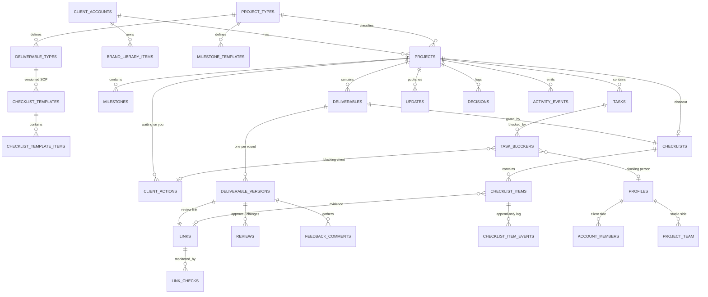

# Griida Client Portal — Architecture & Schema

*Technical design derived from `Client-Portal-Strategy.md`. Every decision here traces back to a strategy section; those references are marked §.*

---

## 0. Assumptions

1. **Single studio, many client accounts.** Griida is the only studio. Not built as multi-tenant SaaS — but §12 notes the one change that would make it so.
2. **Real application stack, not a WordPress members area.** Requesting a schema settles the build-vs-buy question in §7.7.
3. **No file storage anywhere.** Every artifact is a link (§3c). There is no storage bucket in this design, and adding one later would be a strategy change, not a technical one.
4. **Postgres is the enforcement point for visibility**, not application code (§2.2).

---

## 1. Stack

| Layer | Choice | Why this one |
|---|---|---|
| Database | **Postgres (Supabase)** | Row-Level Security lets the two-lens publish boundary (§3b) be enforced in the database rather than in every query someone might forget |
| Auth | **Supabase Auth, magic link** | §6b requires passwordless — nobody types a password on a phone between meetings. Magic link is native here, not a bolt-on |
| API | **Next.js App Router, server components + server actions** | One codebase, two route groups, no separate API tier to keep in sync |
| Hosting | **Vercel** | Edge-rendered client pages matter for mobile TTFB (§6b) |
| Jobs | **Supabase Edge Functions + pg_cron** | Link health checks, digests, nudges. Low volume; no queue infrastructure needed |
| Email | **Resend** (or Postmark) with inbound parsing | Inbound is required for reply-by-email (§10.3) |
| Notifications | Email + Web Push | Native app is out of scope; Web Push covers the §6b deep-link flow |

**Deliberately absent:** file storage, object CDN, search cluster (Postgres full-text is sufficient at this volume), realtime subscriptions (this is not a collaborative editor), and **any LLM or inference service** — the drafted update is deterministic (§6a).

---

## 2. Architecture

### 2.1 Two route groups, one database

```
app/
  (client)/          # mobile-first, 375px baseline, magic-link auth
    [account]/
      page.tsx                    # workspace: roll-up health + "waiting on you"
      [project]/
        page.tsx                  # timeline + updates
        review/[deliverable]/     # approve / request changes
  (studio)/          # desktop-first, distinct visual chrome (§3b)
    projects/[id]/                # internal project view
    my-work/                      # per-person, mobile-good (§6b)
    standup/                      # walkthrough view (§5c)
    admin/                        # SOP templates — super admin only
```

The two groups share the database and nothing else — separate layouts, separate design treatment, separate navigation. §3b calls ambiguity between internal and client views a trust-killer; distinct route groups make it structurally hard to render the wrong one.

### 2.2 The publish boundary is RLS, not application code

This is the single most important architectural decision. Client-visible data is defined by database policy:

- A client user can only `SELECT` rows that are explicitly published or explicitly marked client-visible.
- No table containing internal-only data (tasks, checklists, evidence, waivers, internal notes) has *any* policy granting client access. Not a filtered policy — **no policy at all**.
- Application code cannot leak what the database will not return.

The alternative — filtering in queries — fails the first time someone writes a new query and forgets. Given §3b's assessment that one leaked internal note costs more than the feature earns, the cost of RLS is worth paying.

### 2.3 Append-only events, projected state

Two tables are **immutable logs**: `checklist_item_events` and `activity_events`. Nothing updates or deletes rows in them. Current state (`checklist_items.state`) is a denormalized projection maintained by trigger, existing purely for query speed.

This is what makes §5b's "ticking is a signed event" real. An audit trail assembled from mutable rows is not an audit trail.

### 2.4 Templates snapshot on instantiation

Creating a project copies templates into instances inside one transaction (§10.2, §5b). Instances never reference templates for their content — only for provenance. A super admin editing an SOP tomorrow cannot alter, invalidate, or un-complete anything already in flight.

### 2.5 Aging is computed, never stored

Every state-bearing table carries `state_changed_at`. Ages are computed in views at read time. §5a: *a status can be stale and still look fine; an age can't lie.* Storing a duration would create a value that needs updating and can therefore be wrong.

### 2.6 The draft composer is a SQL function

`compose_update_draft(project_id)` reads `activity_events` since the last published update and emits templated sentences from counts and names. No model, no network call, no possibility of fabricating something about a client's project (§6a).

---

## 3. Schema

*DDL below is grouped by concept for readability, so some forward references appear (e.g. `project_client_roles` cites `projects`). A real migration orders by dependency; §11 gives that order. Requires Postgres 15+ for `unique nulls not distinct`.*

### 3.1 Enums

```sql
create type user_kind        as enum ('studio', 'client');
create type studio_role      as enum ('super_admin', 'admin_pm', 'lead', 'member');
create type client_role      as enum ('owner', 'reviewer', 'viewer');

create type project_status   as enum ('draft', 'active', 'on_hold', 'done', 'archived');
create type health_status    as enum ('on_track', 'at_risk', 'blocked');
create type milestone_status as enum ('not_started', 'in_progress', 'complete');

create type deliverable_status as enum
  ('draft', 'in_review', 'changes_requested', 'approved', 'delivered');

create type task_status      as enum ('todo', 'in_progress', 'blocked', 'done');
create type blocker_kind     as enum ('user', 'task', 'client_action');

create type evidence_kind    as enum ('none', 'link', 'text');
create type checklist_scope  as enum ('deliverable', 'project_closeout');
create type item_state       as enum ('open', 'checked', 'countersigned', 'waived');
create type item_event_kind  as enum
  ('checked', 'unchecked', 'countersigned', 'countersign_revoked', 'waived', 'evidence_updated');

create type template_status  as enum ('draft', 'published', 'archived');
create type link_health      as enum ('unknown', 'ok', 'unreachable', 'forbidden');
create type visibility       as enum ('internal', 'client');
create type update_status    as enum ('draft', 'published');
create type review_decision  as enum ('pending', 'approved', 'changes_requested');
create type client_action_status as enum ('open', 'submitted', 'accepted');
create type slip_reason      as enum
  ('client_latency', 'scope_change', 'capacity', 'estimate_wrong', 'external');
```

### 3.2 Identity & access

```sql
create table profiles (
  id            uuid primary key references auth.users on delete cascade,
  kind          user_kind not null,
  studio_role   studio_role,                 -- null for clients
  full_name     text not null,
  avatar_url    text,
  is_active     boolean not null default true,
  created_at    timestamptz not null default now(),
  constraint studio_users_have_a_role
    check ((kind = 'studio') = (studio_role is not null))
);

create table client_accounts (
  id          uuid primary key default gen_random_uuid(),
  name        text not null,
  slug        text not null unique,
  status      text not null default 'active',
  created_at  timestamptz not null default now()
);

create table account_members (
  account_id  uuid not null references client_accounts on delete cascade,
  user_id     uuid not null references profiles on delete cascade,
  is_primary  boolean not null default false,
  primary key (account_id, user_id)
);
```

Per-project client roles (§3: *"roles are set per project inside the account — not one global role"*) and the internal team assignment are separate tables, because they are different concepts with different enums:

```sql
create table project_client_roles (
  project_id  uuid not null references projects on delete cascade,
  user_id     uuid not null references profiles on delete cascade,
  role        client_role not null,
  primary key (project_id, user_id)
);

create table project_team (
  project_id  uuid not null references projects on delete cascade,
  user_id     uuid not null references profiles on delete cascade,
  is_lead     boolean not null default false,
  primary key (project_id, user_id)
);
```

### 3.3 Links — the artifact substrate

Because the portal stores no files (§3c), `links` is a first-class table that most other entities point at, not an incidental column.

```sql
create table links (
  id                uuid primary key default gen_random_uuid(),
  url               text not null,
  label             text not null,
  provider          text,                    -- figma | drive | staging | loom | other
  account_id        uuid references client_accounts on delete cascade,
  added_by          uuid not null references profiles,
  is_durable        boolean not null default false,  -- closeout requires this (§5b)
  client_access_ok  boolean,                 -- verified before publish; null = unverified
  access_checked_at timestamptz,
  health            link_health not null default 'unknown',
  last_checked_at   timestamptz,
  created_at        timestamptz not null default now()
);

create table link_checks (
  id          bigserial primary key,
  link_id     uuid not null references links on delete cascade,
  checked_at  timestamptz not null default now(),
  http_status int,
  result      link_health not null,
  note        text
);
create index on link_checks (link_id, checked_at desc);
```

`client_access_ok` is what backs the one gate with no override (§5b): nothing publishes carrying a link the client cannot open.

The account-level brand library (§3a) and the per-project document registry are both thin tables over `links`:

```sql
create table brand_library_items (
  id          uuid primary key default gen_random_uuid(),
  account_id  uuid not null references client_accounts on delete cascade,
  link_id     uuid not null references links on delete cascade,
  category    text not null,                 -- logo | guidelines | fonts | credentials | other
  notes       text,
  created_at  timestamptz not null default now()
);

create table project_documents (
  id          uuid primary key default gen_random_uuid(),
  project_id  uuid not null references projects on delete cascade,
  link_id     uuid not null references links on delete cascade,
  category    text not null,                 -- contract | sow | brief | invoice | other
  is_client_visible boolean not null default true,
  created_at  timestamptz not null default now()
);
```

### 3.4 Taxonomy & SOP templates *(super admin only)*

```sql
create table project_types (
  id          uuid primary key default gen_random_uuid(),
  name        text not null,                 -- Brand Identity | Product UI | Website
  slug        text not null unique,
  is_active   boolean not null default true
);

create table milestone_templates (
  id              uuid primary key default gen_random_uuid(),
  project_type_id uuid not null references project_types on delete cascade,
  name            text not null,
  position        int not null,
  unique (project_type_id, position)
);

create table deliverable_types (
  id              uuid primary key default gen_random_uuid(),
  project_type_id uuid not null references project_types on delete cascade,
  name            text not null,
  default_milestone_template_id uuid references milestone_templates,
  -- §6b: high-stakes deliverables cannot be approved from a phone
  requires_considered_review boolean not null default false
);
```

One versioned checklist-template model serves both deliverable SOPs and the project closeout SOP (§5b), rather than duplicating the item structure:

```sql
create table checklist_templates (
  id                  uuid primary key default gen_random_uuid(),
  scope               checklist_scope not null,
  deliverable_type_id uuid references deliverable_types on delete cascade,
  project_type_id     uuid references project_types on delete cascade,
  version             int not null,
  status              template_status not null default 'draft',
  published_at        timestamptz,
  published_by        uuid references profiles,
  constraint scope_target_matches check (
    (scope = 'deliverable'       and deliverable_type_id is not null and project_type_id is null) or
    (scope = 'project_closeout'  and project_type_id is not null and deliverable_type_id is null)
  ),
  unique nulls not distinct (scope, deliverable_type_id, project_type_id, version)
);

create table checklist_template_items (
  id                   uuid primary key default gen_random_uuid(),
  template_id          uuid not null references checklist_templates on delete cascade,
  position             int not null,
  label                text not null,
  guidance             text,                 -- the SOP itself; shown at point of use (§5b)
  is_required          boolean not null default true,
  evidence_kind        evidence_kind not null default 'none',
  expected_source      text,                 -- hint only: "Figma" | "Drive". Never hard-validated
  requires_countersign boolean not null default false,
  is_final_deliverable boolean not null default false,  -- feeds the delivery index (§4)
  applies_when_tag     text,                 -- e.g. 'dark-mode'; null = always applies
  unique (template_id, position)
);
```

### 3.5 Projects, milestones, deliverables

```sql
create table projects (
  id              uuid primary key default gen_random_uuid(),
  account_id      uuid not null references client_accounts on delete cascade,
  project_type_id uuid not null references project_types,
  name            text not null,
  status          project_status not null default 'draft',

  health          health_status not null default 'on_track',
  health_note     text,                                   -- plain English "why" (§3)
  health_set_by   uuid references profiles,
  health_set_at   timestamptz,

  applies_tags    text[] not null default '{}',           -- drives applies_when_tag (§5b)
  rounds_included int not null default 2,                 -- revision counter (§5)

  starts_on       date,
  target_end_on   date,
  actual_end_on   date,
  created_at      timestamptz not null default now()
);

create table milestones (
  id            uuid primary key default gen_random_uuid(),
  project_id    uuid not null references projects on delete cascade,
  name          text not null,
  position      int not null,
  status        milestone_status not null default 'not_started',
  target_date   date,
  completed_at  timestamptz,
  state_changed_at timestamptz not null default now(),
  source_template_id uuid references milestone_templates,  -- provenance only
  unique (project_id, position)
);

create table deliverables (
  id                  uuid primary key default gen_random_uuid(),
  project_id          uuid not null references projects on delete cascade,
  milestone_id        uuid references milestones on delete set null,
  deliverable_type_id uuid not null references deliverable_types,
  name                text not null,
  status              deliverable_status not null default 'draft',
  state_changed_at    timestamptz not null default now(),   -- aging (§2.5)
  owner_id            uuid references profiles,             -- who may tick (§5b)
  current_round       int not null default 1,
  requires_considered_review boolean not null default false, -- snapshot from type
  created_at          timestamptz not null default now()
);

-- Each revision round is its own link (§3c)
create table deliverable_versions (
  id             uuid primary key default gen_random_uuid(),
  deliverable_id uuid not null references deliverables on delete cascade,
  round          int not null,
  review_link_id uuid not null references links,
  summary        text,
  published_at   timestamptz,
  published_by   uuid references profiles,
  unique (deliverable_id, round)
);
```

### 3.6 Checklist instances & the signed event log

```sql
create table checklists (
  id                uuid primary key default gen_random_uuid(),
  scope             checklist_scope not null,
  project_id        uuid not null references projects on delete cascade,
  deliverable_id    uuid references deliverables on delete cascade,
  source_template_id uuid references checklist_templates,   -- provenance
  source_version    int not null,                           -- what it shipped against (§5b)
  created_at        timestamptz not null default now(),
  constraint deliverable_scope_has_deliverable check (
    (scope = 'deliverable') = (deliverable_id is not null)
  )
);

create table checklist_items (
  id                   uuid primary key default gen_random_uuid(),
  checklist_id         uuid not null references checklists on delete cascade,
  position             int not null,
  -- copied at instantiation, never joined back to the template
  label                text not null,
  guidance             text,
  is_required          boolean not null,
  evidence_kind        evidence_kind not null,
  expected_source      text,
  requires_countersign boolean not null,
  is_final_deliverable boolean not null,
  is_applicable        boolean not null default true,   -- resolved from projects.applies_tags
  -- projection maintained by trigger from the event log; never written directly
  state                item_state not null default 'open',
  state_changed_at     timestamptz not null default now(),
  evidence_link_id     uuid references links,
  evidence_text        text,
  unique (checklist_id, position)
);

-- APPEND ONLY. No updates, no deletes. This is the audit trail (§5b, §2.3)
create table checklist_item_events (
  id             bigserial primary key,
  item_id        uuid not null references checklist_items on delete cascade,
  kind           item_event_kind not null,
  actor_id       uuid not null references profiles,
  occurred_at    timestamptz not null default now(),
  evidence_link_id uuid references links,
  evidence_text  text,
  reason         text          -- required for 'waived' and 'unchecked'
);
create index on checklist_item_events (item_id, occurred_at desc);

create rule no_update as on update to checklist_item_events do instead nothing;
create rule no_delete as on delete to checklist_item_events do instead nothing;
```

### 3.7 Work, tagging & blockers

The three-way tag distinction from §5a is modelled as *structure*, not as a mention string:

```sql
create table tasks (
  id             uuid primary key default gen_random_uuid(),
  project_id     uuid not null references projects on delete cascade,
  milestone_id   uuid references milestones on delete set null,
  deliverable_id uuid references deliverables on delete set null,
  title          text not null,
  notes          text,
  responsible_id uuid references profiles,     -- exactly one person, never a team (§5a)
  status         task_status not null default 'todo',
  state_changed_at timestamptz not null default now(),
  due_on         date,
  created_by     uuid not null references profiles,
  created_at     timestamptz not null default now(),
  completed_at   timestamptz
);

create table task_blockers (
  id                uuid primary key default gen_random_uuid(),
  task_id           uuid not null references tasks on delete cascade,
  kind              blocker_kind not null,
  blocked_by_user   uuid references profiles,
  blocked_by_task   uuid references tasks,
  client_action_id  uuid references client_actions,
  note              text,
  created_by        uuid not null references profiles,
  created_at        timestamptz not null default now(),  -- age lives here (§2.5)
  resolved_at       timestamptz,
  constraint exactly_one_target check (
    num_nonnulls(blocked_by_user, blocked_by_task, client_action_id) = 1
  )
);
create index on task_blockers (blocked_by_user) where resolved_at is null;
```

That partial index is what makes **"Blocking others"** (§5a) a single fast query — the screen nobody builds and everybody needs.

A plain mention carries no obligation, so it is a notification and nothing more (§5a) — see §3.10.

### 3.8 Client actions — "Waiting on you"

```sql
create table client_actions (
  id            uuid primary key default gen_random_uuid(),
  project_id    uuid not null references projects on delete cascade,
  title         text not null,
  description   text,
  assigned_to   uuid references profiles,
  due_on        date,
  status        client_action_status not null default 'open',
  blocks_note   text,                          -- "Blocks: logo concepts" (§5A)
  response_link_id uuid references links,      -- client pastes a link, not a file (§3c)
  response_text text,
  created_at    timestamptz not null default now(),
  submitted_at  timestamptz,
  accepted_at   timestamptz,
  nudge_count   int not null default 0,
  last_nudged_at timestamptz
);
```

Because `task_blockers` can point at a `client_action`, "we're waiting on you" becomes provable rather than a claim (§5a), and the same join feeds the SLA meter.

### 3.9 Publishing, reviews & the activity spine

```sql
-- The spine. The draft composer reads this; auto-propagated facts are visible immediately
create table activity_events (
  id           bigserial primary key,
  project_id   uuid not null references projects on delete cascade,
  actor_id     uuid references profiles,
  kind         text not null,               -- 'deliverable.in_review', 'task.completed', …
  subject_kind text,
  subject_id   uuid,
  payload      jsonb not null default '{}',
  visibility   visibility not null default 'internal',
  occurred_at  timestamptz not null default now()
);
create index on activity_events (project_id, occurred_at desc);
create rule no_update as on update to activity_events do instead nothing;

-- What the client actually reads (§3b: timeline, updates, review action — nothing else)
create table updates (
  id                uuid primary key default gen_random_uuid(),
  project_id        uuid not null references projects on delete cascade,
  body              text not null,
  health_at_publish health_status,
  review_deliverable_id uuid references deliverables,
  document_link_id  uuid references links,
  status            update_status not null default 'draft',
  drafted_at        timestamptz,             -- set by compose_update_draft()
  published_by      uuid references profiles,
  published_at      timestamptz
);

create table update_reads (               -- "seen by" (§10.4) — studio-visible only
  update_id     uuid not null references updates on delete cascade,
  user_id       uuid not null references profiles on delete cascade,
  first_read_at timestamptz not null default now(),
  last_read_at  timestamptz not null default now(),
  primary key (update_id, user_id)
);

create table reviews (
  id             uuid primary key default gen_random_uuid(),
  version_id     uuid not null references deliverable_versions on delete cascade,
  round          int not null,
  decision       review_decision not null default 'pending',
  requested_at   timestamptz not null default now(),
  decided_by     uuid references profiles,
  decided_at     timestamptz,
  decision_note  text
);

create table feedback_comments (
  id          uuid primary key default gen_random_uuid(),
  version_id  uuid not null references deliverable_versions on delete cascade,
  author_id   uuid not null references profiles,
  body        text not null,
  source      text not null default 'portal',   -- 'portal' | 'email' (§10.3)
  created_at  timestamptz not null default now(),
  resolved_at timestamptz,
  resolved_by uuid references profiles
);

create table revision_requests (          -- rounds beyond what's included (§5)
  id           uuid primary key default gen_random_uuid(),
  project_id   uuid not null references projects on delete cascade,
  deliverable_id uuid references deliverables,
  description  text not null,
  cost_amount  numeric(12,2),
  currency     text default 'NGN',
  status       text not null default 'proposed',
  accepted_by  uuid references profiles,
  accepted_at  timestamptz
);

create table decisions (                  -- §10.1 — cheapest high-value table here
  id             uuid primary key default gen_random_uuid(),
  project_id     uuid not null references projects on delete cascade,
  summary        text not null,
  decided_on     date not null,
  decided_by     text not null,           -- free text: may be a client who has no login
  deliverable_id uuid references deliverables,
  recorded_by    uuid not null references profiles,
  is_client_visible boolean not null default true,
  created_at     timestamptz not null default now()
);
```

### 3.10 Notifications, standup, learning loop

```sql
create table notifications (
  id          uuid primary key default gen_random_uuid(),
  user_id     uuid not null references profiles on delete cascade,
  kind        text not null,              -- includes 'mention' (no obligation — §5a)
  title       text not null,
  body        text,
  deep_link   text not null,              -- straight to the item (§6b)
  entity_kind text,
  entity_id   uuid,
  read_at     timestamptz,
  emailed_at  timestamptz,
  pushed_at   timestamptz,
  created_at  timestamptz not null default now()
);
create index on notifications (user_id, created_at desc) where read_at is null;

create table standup_checkins (           -- async mode only (§5c)
  id          uuid primary key default gen_random_uuid(),
  project_id  uuid not null references projects on delete cascade,
  user_id     uuid not null references profiles on delete cascade,
  on_date     date not null default current_date,
  moved       text,
  blocked_by  text,
  needs       text,
  created_at  timestamptz not null default now(),
  unique (project_id, user_id, on_date)
);

create table milestone_slips (            -- estimate vs actual (§10.6)
  id           uuid primary key default gen_random_uuid(),
  milestone_id uuid not null references milestones on delete cascade,
  from_date    date not null,
  to_date      date not null,
  reason       slip_reason not null,
  note         text,
  recorded_by  uuid not null references profiles,
  recorded_at  timestamptz not null default now()
);
```

---

## 4. Entity relationships



---

## 5. State machines & gates

### 5.1 Deliverable

```
draft ──(gate: checklist passes + link access verified)──▶ in_review
in_review ──▶ approved ──▶ delivered
in_review ──▶ changes_requested ──▶ (new version, round+1) ──▶ in_review
```

### 5.2 The gate function

```sql
create or replace function can_publish_deliverable(p_deliverable uuid)
returns table (ok boolean, blocking_reason text)
language sql stable as $$
  with items as (
    select ci.*
    from checklist_items ci
    join checklists c on c.id = ci.checklist_id
    where c.deliverable_id = p_deliverable and ci.is_applicable
  ),
  unmet as (
    select count(*) n from items
    where is_required and state not in ('countersigned', 'waived')
      and not (state = 'checked' and not requires_countersign)
  ),
  link_ok as (
    select coalesce(bool_and(l.client_access_ok), false) ok
    from deliverable_versions dv
    join links l on l.id = dv.review_link_id
    where dv.deliverable_id = p_deliverable
      and dv.round = (select current_round from deliverables where id = p_deliverable)
  )
  select
    (unmet.n = 0 and link_ok.ok),
    case
      when not link_ok.ok then 'Review link is not verified as viewable by the client'
      when unmet.n > 0    then unmet.n || ' required checklist item(s) outstanding'
    end
  from unmet, link_ok;
$$;
```

Note the asymmetry, straight from §5b: **checklist items can be waived with a reason; the link access check cannot.** It is the only hard block in the system, because it is the only failure the client experiences directly.

### 5.3 Project → DONE

Requires every deliverable at `delivered` **and** the closeout checklist complete (§5b) — final links flagged `is_durable`, delivery index published, invoice raised, case-study assets captured. Overridable with a logged reason, per §5b's recommendation that valve-less gates get routed around.

---

## 6. Derived views

```sql
-- Blocking others (§5a) — the morning screen
create view v_blocking_others as
select tb.blocked_by_user as user_id, t.id task_id, t.title, p.name project,
       now() - tb.created_at as age
from task_blockers tb
join tasks t on t.id = tb.task_id
join projects p on p.id = t.project_id
where tb.kind = 'user' and tb.resolved_at is null;

-- Standup walkthrough (§5c) — a view over existing data; nobody types status twice
create view v_standup_project as
select p.id project_id, p.name, p.health,
  (select count(*) from activity_events a
     where a.project_id = p.id and a.occurred_at > coalesce(
       (select max(published_at) from updates u where u.project_id = p.id), p.created_at)
  ) as changes_since_last_standup,
  (select count(*) from tasks t
     join task_blockers b on b.task_id = t.id and b.resolved_at is null
     where t.project_id = p.id) as blocked_count,
  (select count(*) from tasks t
     where t.project_id = p.id and t.status <> 'done' and t.due_on < current_date) as overdue,
  (select count(*) from client_actions ca
     where ca.project_id = p.id and ca.status = 'open') as waiting_on_client,
  (select max(now() - ca.created_at) from client_actions ca
     where ca.project_id = p.id and ca.status = 'open') as oldest_client_item
from projects p
where p.status = 'active';
```

Aging appears in both — §2.5.

---

## 7. Row-Level Security

```sql
-- Helper: stable, indexed, avoids re-evaluating auth.uid() per row
create or replace function is_studio() returns boolean
language sql stable security definer as $$
  select exists (select 1 from profiles
                 where id = (select auth.uid()) and kind = 'studio' and is_active);
$$;

create or replace function has_project_access(p uuid) returns boolean
language sql stable security definer as $$
  select is_studio() or exists (
    select 1 from project_client_roles
    where project_id = p and user_id = (select auth.uid())
  );
$$;
```

| Table | Client policy |
|---|---|
| `projects`, `milestones` | SELECT where `has_project_access()` |
| `updates` | SELECT where `status = 'published'` and project access |
| `deliverables` | SELECT where `status <> 'draft'` and project access |
| `deliverable_versions`, `reviews`, `feedback_comments` | SELECT + INSERT own decisions, project access |
| `client_actions` | SELECT + UPDATE own responses |
| `decisions` | SELECT where `is_client_visible` |
| `project_documents`, `brand_library_items` | SELECT where visible, account access |
| **`tasks`, `task_blockers`, `checklists`, `checklist_items`, `checklist_item_events`, `activity_events`, `standup_checkins`, `update_reads`, `milestone_slips`, `notifications`(others') , all `*_templates`** | **No client policy exists at all** (§2.2) |

`checklist_templates` and `checklist_template_items` additionally restrict INSERT/UPDATE to `studio_role = 'super_admin'` — §3b centralises authoring so the SOP means something.

---

## 8. Key operations

| Operation | Implementation |
|---|---|
| **Create project from type** (§10.2) | `instantiate_project()` — one transaction copying milestone templates → `milestones`, deliverable types → `deliverables`, and the published checklist template version → `checklists` + `checklist_items`, filtering `applies_when_tag` against `projects.applies_tags` |
| **Tick a checklist item** | Insert into `checklist_item_events`; trigger projects `checklist_items.state`. Authorisation: actor must be `deliverables.owner_id` or on `project_team` (§5b) |
| **Countersign** | Same log, `kind='countersigned'`, actor must have `studio_role in ('lead','admin_pm','super_admin')` and **must not be the actor who checked it** — enforced in the trigger, not the UI |
| **Publish deliverable to client** | `can_publish_deliverable()` → verify link → transition → emit `activity_events` with `visibility='client'` → notify |
| **Compose update draft** (§6a) | `compose_update_draft()`: templated sentences from event counts. Deterministic, no model |
| **Publish update** | Set `status='published'`; fan out notifications with deep links (§6b) |
| **Delivery index** (§4) | Select `checklist_items where is_final_deliverable` across the project, joined to `links` |

---

## 9. Background jobs

| Job | Cadence | Purpose |
|---|---|---|
| `check_link_health` | Hourly for active projects, weekly for archived | Populate `link_checks`; alert **internally** on failure — never surface a broken link to a client (§3c) |
| `nudge_client_actions` | Daily | Calm escalation ladder on overdue items (§10.5); increments `nudge_count` |
| `client_digest` | Weekly, per account | Human-toned email, deep-linked (§4) |
| `studio_digest` | Weekly | Health, aging blockers, rounds burned (§10.9) |
| `inbound_email` | Webhook | Parse reply → `feedback_comments` with `source='email'` (§10.3) |

---

## 10. Brand tokens

From the logo: a gradient running **violet → magenta → cyan → spring green**, on near-black wordmark.

```css
--griida-violet:  #A855F7;
--griida-magenta: #FF6FB1;
--griida-cyan:    #12C2FF;
--griida-green:   #00F0A8;
--griida-ink:     #04070D;   /* wordmark black */
--griida-gradient: linear-gradient(135deg,
  var(--griida-violet), var(--griida-magenta),
  var(--griida-cyan), var(--griida-green));
```

**Usage rule, extending §6a:** the gradient is the *mark's* territory. It may appear on the logo, and at most one deliberate accent moment per screen — never on cards, buttons, headers, backgrounds, or section dividers. §6a warns against gradient-heavy UI because it reads as generated; a brand-owned gradient used with restraint reads as identity. The distinction is entirely in the discipline.

Interface colour otherwise stays near-monochrome — `--griida-ink` on white, with **cyan for interactive states** and **green reserved exclusively for approved/complete**. Health states need their own accessible triad that does not collide with the brand gradient.

---

## 11. Build order

1. **Foundation** — profiles, accounts, projects, project types, milestones, RLS helpers. Nothing is client-visible yet.
2. **Links + deliverables + versions + reviews** — the client can see a timeline and approve something. Mobile-first from the first wireframe (§6b).
3. **Templates + checklists + event log + gate** — the SOP layer. Highest value per line of code in this design (§8, Phase 1).
4. **Updates + activity events + draft composer** — publishing.
5. **Tasks + blockers + aging** — must precede standup; standup is a view over this data and has nothing to show without it (§8).
6. **Standup mode** — and with it, the ritual that makes everything above stay current (§5c, §7.1).
7. **Jobs, digests, decisions log, delivery index.**

---

## 12. Notes on things deliberately not built

- **No multi-tenancy.** Adding `studio_id` to `client_accounts`, `project_types` and `profiles` — plus one predicate in the RLS helpers — would make this sellable to other studios. Nothing else in the schema resists it. Don't build it until someone asks to buy it.
- **No realtime.** Standup is a meeting where people are already talking; a stale-by-30-seconds view is fine.
- **No soft-delete framework.** `archived` statuses cover the real cases; the event logs are already immutable.
- **No file storage.** Not an omission — a strategy commitment (§3c).
- **No AI.** Not an omission — a positioning commitment (§6a).
